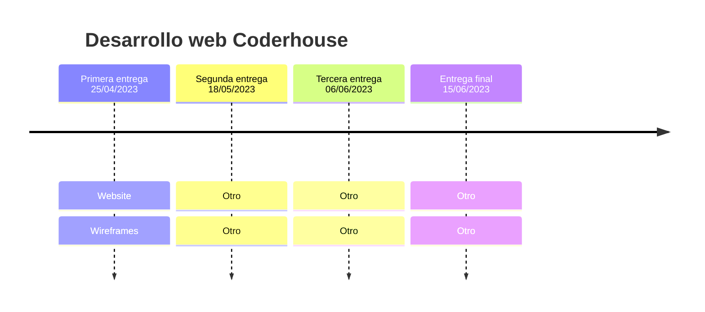

# Proyecto Final Desarrollo Web Coderhouse

### 👉 Content
>Sitio web de un restaurante llamado "LA FOURCHETTE". Para el curso de desarrollo web en Coderhouse.

### 🚀 Environments

| Phase  | QA            | Production    |
|:------:|:-------------:|:-------------:|
| Build  | [](https://desarrollo-web-coderhouse-pi.vercel.app/)         | Not available |

### Built With

* 
* 


##  📅 Roadmap



## 👨‍🔧 Folders Structure

### General

```
.
├── css
├── img 
├── pages
├── wireframes
│ index.html             
│ .gitignore
│ README.md
```


### Pages

```
.
├── ...
├── pages                    
│   ├── about.html           # Pagina de la seccion nosotros
│   ├── booking.html         # Pagina de para la reserva
│   ├── location.html        # Pagina de la ubicación del restaurante
|   └── menu.html            # Pagina del menu del restaurante
├─── index.html              # Pagina del Home del restaurante
└── ...
```

### Assets

```
.
├── ...
├── img                    
│   ├── comidas         # Imagenes de las comidas utilizadas en el menu.
│   ├── postres         # Imagenes de los postres utilizados en el menu.
│   ├── logo            # Imagenes de los logos utilizados en el sitio.
|   └── ...
└── ...
```

## 👋 Reach me

